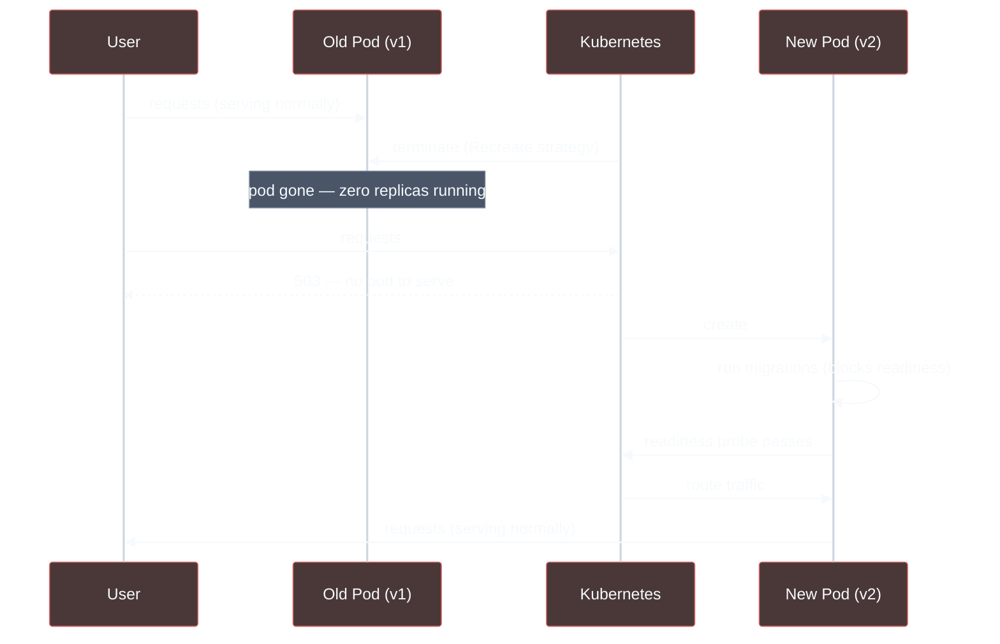
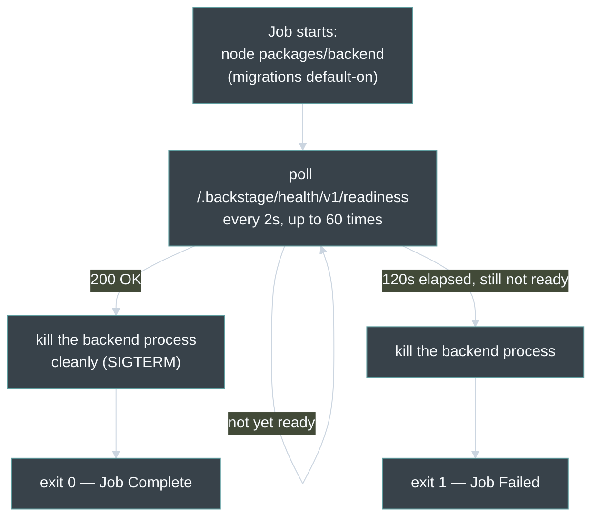
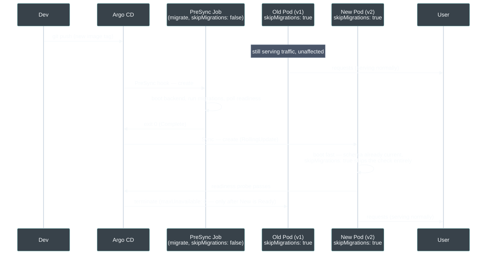

# Separate DB Migrations from the Deployment Rollout via an Argo CD PreSync Hook

## Status
Accepted

## Context

Backstage's backend runs Knex-based database schema migrations on every
process startup — every installed plugin (catalog, scaffolder, auth,
notifications, …) independently checks its own migration state against the
shared CloudNativePG-backed Postgres database and applies any pending
migrations before it starts serving requests. This is baked into
[`packages/backend/Dockerfile`](https://github.com/lukasb27/backstage-app/blob/main/packages/backend/Dockerfile#L84)'s
entrypoint — there is no separate "migrate only" mode; booting the backend
*is* running the migrations.

Migrations are schema-changing operations — Data Definition Language (DDL),
such as `ALTER TABLE` or `CREATE INDEX` — not the ordinary read/write queries
(Data Manipulation Language, or DML: `SELECT`, `INSERT`, `UPDATE`, …) that
many replicas are designed to run concurrently against the same tables. Two
processes racing to apply the *same* schema change against the *same*
database is a real correctness risk: lock contention, deadlocks, or a
corrupted migration-tracking table. A standard
Kubernetes `RollingUpdate` briefly runs the old and new pod together — that
overlap is exactly what makes it zero-downtime — but if both pods are
Backstage, both attempt migrations at once.

The deployment previously avoided this entirely with
[`strategy: Recreate`](https://github.com/lukasb27/backstage-app/blob/main/backstage-values.yaml#L229)
on the `backstage` chart's Deployment: kill the old pod completely, *then*
start the new one, guaranteeing only one Backstage process ever touches the
database at a time. Correct, but it means a full outage window on every
single deploy — confirmed live on 2026-08-15 (a run of 500s during the
Mermaid-addon rollout, timed exactly to the old pod terminating before the
new one became `Ready`).

Backstage ships no built-in "migrate and exit" entrypoint — this was
confirmed by inspecting the installed packages directly, not assumed.
`backend.database.skipMigrations` exists
([`config.schema.json`](https://github.com/backstage/backstage/blob/master/packages/backend-defaults/config.schema.json))
but it's an *opt-out* flag independently checked by every plugin's own
backend module (verified in
`node_modules/@backstage/plugin-catalog-backend/dist/service/CatalogBuilder.cjs.js`,
`plugin-scaffolder-backend/dist/scaffolder/tasks/DatabaseTaskStore.cjs.js`,
`plugin-auth-backend/dist/database/AuthDatabase.cjs.js`, and others) — there's
no single switch that runs every plugin's migrations once and then exits.
Official docs don't cover this deployment scenario, and a real upstream
issue ([backstage/backstage#24284](https://github.com/backstage/backstage/issues/24284),
"MigrationLocked: Migration table is already locked") confirms Knex's own
advisory-lock mechanism is fragile under concurrent pod starts — which
validates the original `Recreate` concern rather than offering a way around
it.

## Decision

Run the *actual* backend process as a dedicated pre-deploy step — not a
stripped-down migration script, since none exists — and shut it down cleanly
once it reports healthy, since "healthy" only happens after every plugin has
finished its own migrations. Concretely, three changes, all in
[`backstage-values.yaml`](https://github.com/lukasb27/backstage-app/blob/main/backstage-values.yaml):

**1. A `PreSync` hook Job** (lines
[62–132](https://github.com/lukasb27/backstage-app/blob/main/backstage-values.yaml#L62-L132)),
added via the chart's `extraDeploy` — the same mechanism already used for the
Ingress. Same image as the main Deployment (`{{ include "backstage.image" . }}`,
resolved by the chart's own helper so it can never drift out of sync with
whatever tag CI just bumped), same database/GitHub credentials (a YAML anchor,
`&backstageExtraEnvVars`, shared with `backstage.extraEnvVars` so the two env
lists can't accidentally diverge). Its command boots the real backend with
migrations at their default (enabled), polls
[`/.backstage/health/v1/readiness`](https://github.com/lukasb27/backstage-app/blob/main/backstage-values.yaml#L306-L310)
— the same endpoint the Deployment's own readiness probe already trusts —
and once it returns 200, sends the process a clean kill and exits 0. A 180s
`activeDeadlineSeconds` and `backoffLimit: 1` bound how long a stuck migration
can block a sync before Argo CD gives up and fails the hook outright.

**Why run the whole backend instead of a purpose-built migrate command:**
Backstage genuinely doesn't offer one. Reimplementing migration logic outside
the framework (calling each plugin's Knex migration path directly, bypassing
`createBackend()`) was considered and rejected — it's unsupported internal
API, and it would need to be manually kept in sync with every plugin
installed, silently missing migrations for any plugin added later. Booting
the real backend costs a little extra time and a wasted HTTP listener, but it
automatically covers every currently-installed plugin, forever, with zero
maintenance.

**2. `skipMigrations: true` on the main Deployment only**
([lines 401–414](https://github.com/lukasb27/backstage-app/blob/main/backstage-values.yaml#L401-L414),
via `backstage.appConfig`, which the chart auto-renders into a ConfigMap and
layers on as an extra `--config` file). This is what actually makes
concurrent pods safe: the Deployment's own pods now never attempt a
migration at all, no matter how many run at once — only the PreSync Job
ever does.

**3. `strategy` switched from `Recreate` to `RollingUpdate`**
([lines 229–236](https://github.com/lukasb27/backstage-app/blob/main/backstage-values.yaml#L229-L236)),
explicit `maxSurge: 1, maxUnavailable: 0` — with `replicas: 1`, this means
Kubernetes starts the new pod *before* touching the old one, and only tears
down the old pod once the new one passes its readiness probe. Genuinely
zero-downtime, now that it's safe for two pods to briefly coexist.

## Consequences

**Positive:** deploys are now genuinely zero-downtime — verified by the
`maxSurge: 1, maxUnavailable: 0` overlap window replacing the previous
guaranteed zero-replica gap. Migration failures now block the sync with a
clear, dedicated Job status (`kubectl logs job/backstage-db-migrate`) instead
of manifesting as an endless crash-loop on the main Deployment's pods. The
image, credentials, and readiness contract are all shared with the main
Deployment via Helm helpers and a YAML anchor, so there's no separate
migration-specific configuration to drift out of sync over time.

**Negative / debt:** the PreSync Job boots the *entire* backend just to run
migrations, which is wasteful (extra ~seconds of boot time, a throwaway HTTP
listener) — an accepted cost given Backstage provides no lighter-weight
alternative. This mechanism only guarantees *migrations don't race each
other*; it does not guarantee that any individual migration is safe to apply
while the *old* pod's code is still running against the new schema during
the `RollingUpdate` overlap window. That's the "expand/contract" discipline
(additive-only migrations; defer any rename/drop to a later release), which
this design can't enforce — it depends on upstream Backstage/plugin authors
following it in migrations we don't write ourselves. In practice they
generally do (Backstage is mature and widely deployed), but it's a real
trust boundary, not something this change controls.

## Revisit Trigger

Revisit if Backstage ever ships an official migrate-only mode (would let the
PreSync Job skip booting the full backend), if a migration from an installed
plugin turns out *not* to be backward-compatible with the previous release's
code (the expand/contract gap above, materializing as a real incident, not
just a theoretical risk), or if replica count grows beyond 1 (the current
`maxSurge`/`maxUnavailable` values were chosen specifically for
`replicas: 1`).
