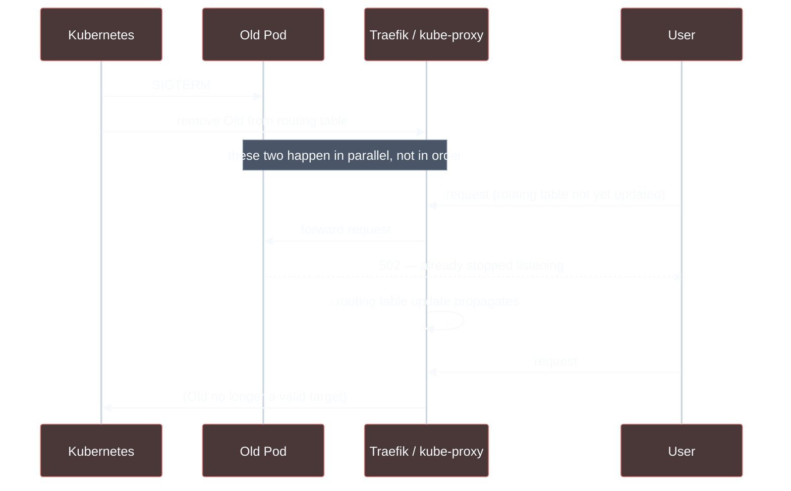

# Close the RollingUpdate Cutover Gap with a preStop Hook

## Status
Accepted

## Context

Switching the Deployment's `strategy` from `Recreate` to `RollingUpdate`
(see
[`backstage-db-migration-presync-hook-adr.md`](backstage-db-migration-presync-hook-adr.md))
removed the guaranteed full-outage window on every deploy, but a live test of
the actual rollout — continuously polling `https://backstage.example/` every
0.5s through a real cutover — still recorded one `502` out of roughly 90
requests, at the exact moment the old pod was replaced.

This is standard Kubernetes behavior, not specific to this cluster: when a
pod is terminated, two things happen *in parallel*, not in sequence —
Kubernetes removes the pod from the Service's routing table (the
Endpoints/EndpointSlice object), and the kubelet sends the container
`SIGTERM`. Every component that actually routes traffic (`kube-proxy`, the
Traefik Ingress controller here, or an external cloud load balancer in other
setups) has to separately notice the routing-table change and propagate it —
its own watch-and-apply delay, on top of the above. A request can be routed
using a copy of the table that hasn't caught up yet, straight to a pod that
has already stopped listening.

Kubernetes doesn't solve this generically because the propagation delay is
different for every cluster's networking stack (iptables vs. IPVS vs. an
eBPF dataplane, in-cluster routing vs. an external cloud load balancer with
its own deregistration delay) — instead it exposes a `preStop` lifecycle
hook specifically so each deployment can bridge its own gap.

## Decision

Add a `preStop` hook that sleeps 5 seconds before the container actually
receives `SIGTERM`, via
[`backstage.lifecycleHooks`](https://github.com/lukasb27/backstage-app/blob/main/backstage-values.yaml)
on the `backstage` Deployment. Five seconds is comfortably longer than the
Traefik Ingress controller's typical routing-table propagation time in this
cluster, and short enough not to meaningfully slow down deploys.

This requires bumping the `backstage` Helm chart's `targetRevision` from
`2.8.2` to `2.10.0` in
[`homelab-argocd-control/apps/backstage.yaml`](https://github.com/lukasb27/homelab-argocd-control/blob/main/apps/backstage.yaml) —
`lifecycleHooks` support doesn't exist in `2.8.2` at all. Checked before
bumping: `helm template` with this deployment's actual values produces an
*identical* rendered manifest between `2.8.2` and `2.10.0`, save for the
`helm.sh/chart` label — nothing else in this config touches anything that
changed across those versions.

## Consequences

**Positive:** closes the specific gap observed live (one dropped request per
rollout). Costs nothing when the pod isn't being terminated.

**Negative / debt:** adds a flat 5s to every pod's graceful shutdown time,
whether or not any request was actually in flight — a fixed cost accepted in
exchange for closing a real, observed gap, not tuned against measured
propagation latency. The chart version bump is a separate, if low-risk,
change bundled into this fix — validated via a rendered-output diff between
versions, not by reviewing the chart's own changelog line by line.

Two things this hook does *not* fully close, both currently assumptions
rather than verified facts:

1. **5 seconds is a guess, not a measurement**, chosen to be comfortably
   longer than this cluster's in-cluster Traefik routing propagation. It
   hasn't been measured directly, and it would be nowhere near enough if this
   pattern were ever reused behind an external cloud load balancer instead —
   AWS's ALB, for example, defaults to a 300-second target deregistration
   delay.
2. **Whether Backstage's own process drains gracefully on `SIGTERM`** is a
   separate concern this hook doesn't touch at all. `preStop` only bridges
   the routing-propagation gap; once `SIGTERM` does arrive, the app itself
   still needs to stop accepting new connections and let in-flight ones
   finish before exiting. That behavior hasn't been independently verified
   here — it's assumed, not confirmed.

## Revisit Trigger

Revisit the 5s duration if it's ever observed to be insufficient (a dropped
request during a rollout despite this hook) or unnecessarily long once
propagation latency is actually measured, and revisit the chart version pin
whenever it's next bumped, since this hook's behavior wasn't verified against
any chart version between `2.8.2` and `2.10.0`. Also worth independently
verifying Backstage's `SIGTERM` handling directly (does it drain in-flight
requests, or hard-exit?) rather than continuing to assume it's graceful.
